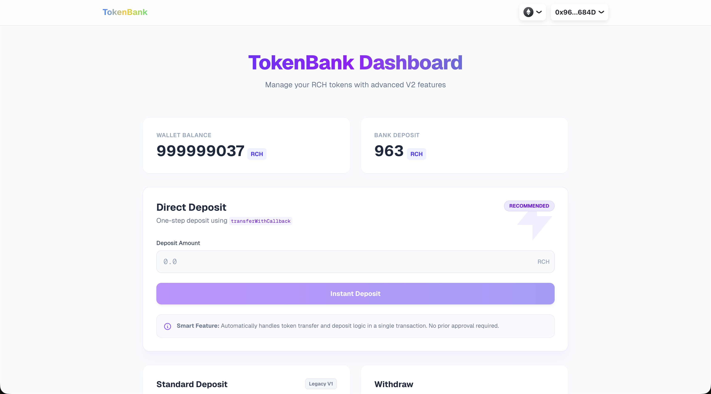

# TokenBank Project

<div align="center">

</div>

<div align="center">

[](LICENSE)
[](https://getfoundry.sh/)
[](https://nextjs.org/)

[English](#english) | [中文](#chinese)

</div>

---

<a name="english"></a>

## 🇬🇧 English

### Overview

TokenBank is a comprehensive Web3 Decentralized Application (DApp) that demonstrates secure ERC-20 token management. The project consists of a robust set of smart contracts and a modern, responsive frontend interface. Users can deposit tokens into the bank using two methods: the standard `Approve + Deposit` flow and a more gas-efficient `transferWithCallback` (ERC-1363 style) mechanism that executes deposits in a single transaction.

The project is structured as a monorepo containing:

- **Contracts**: Solidity smart contracts for the TokenBank logic and the RCH custom token, developed with Foundry.
- **Frontend**: A Next.js 15 application using Wagmi and RainbowKit for wallet interaction.

### 📂 Project Structure

```bash
TokenBank/
├── contracts/       # Smart Contracts (Foundry)
│   ├── src/         # Payment Token (RCH) & Banking Logic
│   ├── test/        # Unit & Integration Tests
│   └── script/      # Deployment Scripts
└── frontend/        # Frontend Application (Next.js)
    ├── src/         # Components, Hooks, and Pages
    └── ...
```

### ✨ Key Features

- **Custom ERC-20 Token (RCH)**: A token implementation that supports callback hooks for smoother UX.
- **Smart Deposits**:
  - Standard Delegate Transfer (`approve` + `deposit`).
  - Callback-based Transfer (`transferWithCallback`), reducing steps for the user.
- **Secure Withdrawals**: Users can withdraw their deposited funds at any time.
- **Full-Stack Integration**: Complete end-to-end integration between the frontend DApp and deployed contracts.

### 🚀 Quick Start

#### 1. Smart Contracts

Navigate to the `contracts` directory to compile and test the contracts.

```bash
cd contracts
forge install
forge build
forge test
```

#### 2. Frontend

Navigate to the `frontend` directory to run the DApp locally.

```bash
cd frontend
pnpm install
pnpm dev
# Open http://localhost:3000 in your browser
```

For more detailed instructions, please refer to the `README.md` files in the respective directories:

- [Contracts Documentation](./contracts/README.md)
- [Frontend Documentation](./frontend/README.md)

---

<a name="chinese"></a>

## 🇨🇳 中文

### 项目简介

TokenBank 是一个完整的 Web3 去中心化应用 (DApp) 案例，演示了安全的 ERC-20 代币管理系统。该项目包含一套稳健的智能合约和一个现代化的前端界面。用户可以通过两种方式将代币存入银行：传统的 `授权 (Approve) + 存款 (Deposit)` 流程，以及更高效的 `transferWithCallback` (类似 ERC-1363) 机制，支持在单笔交易中完成存款。

本项目采用单体仓库 (Monorepo) 结构：

- **Contracts**: 使用 Foundry 开发的 Solidity 智能合约，包含 TokenBank 核心逻辑和自定义的 RCH 代币。
- **Frontend**: 使用 Next.js 15、Wagmi 和 RainbowKit 构建的前端应用。

### 📂 项目结构

```bash
TokenBank/
├── contracts/       # 智能合约 (Foundry)
│   ├── src/         # RCH 代币与银行合约逻辑
│   ├── test/        # 单元测试与集成测试
│   └── script/      # 部署脚本
└── frontend/        # 前端应用 (Next.js)
    ├── src/         # 组件、Hooks 与页面逻辑
    └── ...
```

### ✨ 主要功能

- **自定义 ERC-20 代币 (RCH)**: 实现了回调钩子的代币合约，提供更流畅的用户体验。
- **智能存款**:
  - 标准存款: 经典的 `approve` + `deposit` 模式。
  - 回调存款: `transferWithCallback` 模式，减少用户操作步骤，一键完成。
- **安全取款**: 用户可以随时提取存入银行的资金。
- **全栈集成**: 实现了前端 DApp 与链上合约的完整端到端交互。

### 🚀 快速开始

#### 1. 智能合约

进入 `contracts` 目录进行编译和测试。

```bash
cd contracts
forge install
forge build
forge test
```

#### 2. 前端应用

进入 `frontend` 目录启动本地开发服务器。

```bash
cd frontend
pnpm install
pnpm dev
# 在浏览器中打开 http://localhost:3000
```

更多详细信息，请参阅各自目录下的文档：

- [智能合约文档](./contracts/README.md)
- [前端应用文档](./frontend/README.md)
